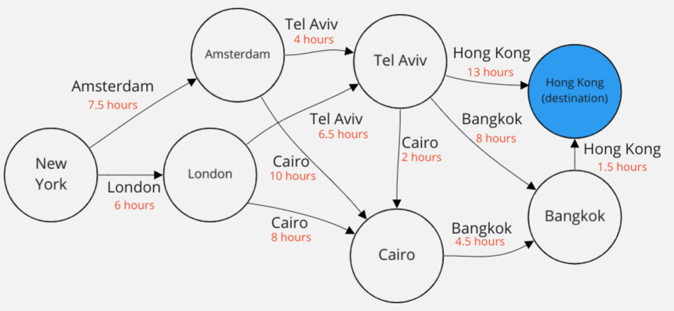

# 1.3 Barry's Execs

Barry's senior execs are spread out across the world. But they have a very important meeting to attend in Hong Kong.

To show brand loyalty, they must always travel by **BarryJet**, but sadly for them, their planes are economy-only and the passengers are rammed in so tightly that it's physically impossible to work. So Barry wants to work out the fastest way for his senior execs to travel to Hong Kong.

**BarryJet** planes only fly from 7 locations: New York, London, Amsterdam, Cairo, Tel Aviv, Bangkok and Hong Kong. Luckily all the execs are in one of these cities.

The below diagram shows the possible locations (circles) and flights that can be taken (arrows), each annotated with it's duration & changeover time.

Barry again wants you to find the policy (in your head) which minimises the time wasted by his execs.

Write the optimal policy dictionary below.

### Important: Hong Kong is a 'terminal state'

This means that once you reach Hong Kong, you can take no actions, and the MDP **terminates**. So you don't need to provide an action for being in the Hong Kong state.

Fill out `main.py` with your answer!