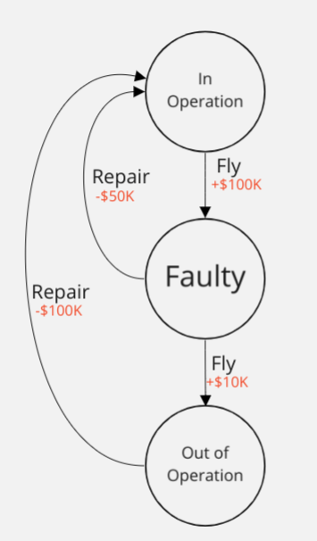
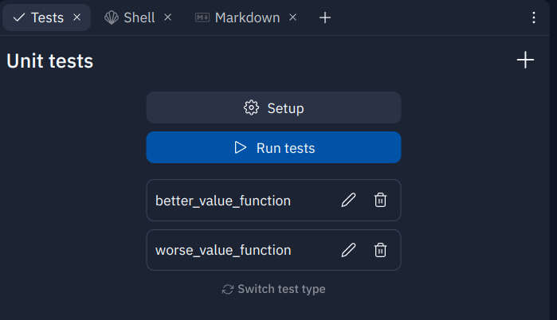
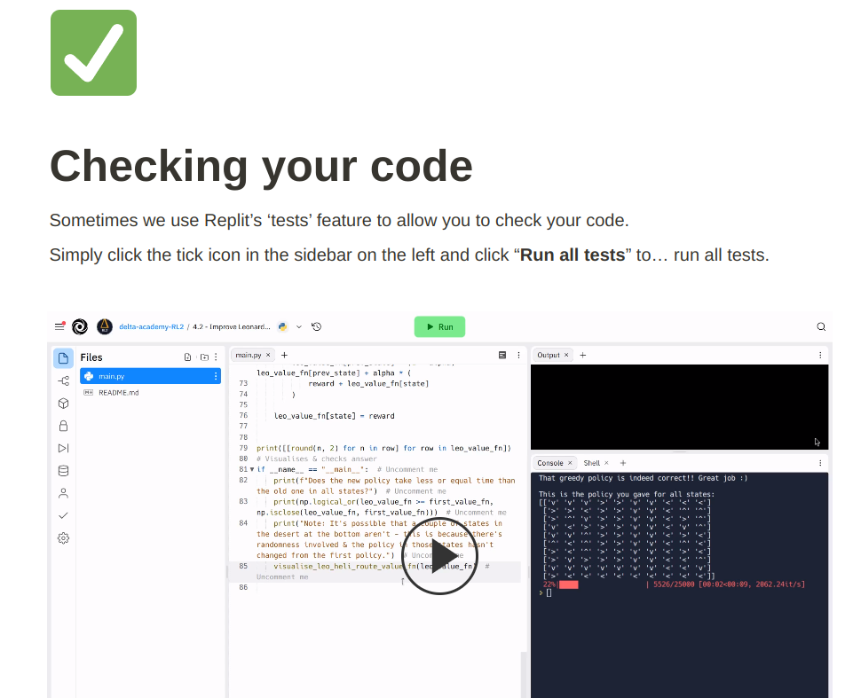

# 2.2 - Plane Repair Value

Now in Hong Kong (that was quick!), Barry's exec's are asking him for proof that the optimal policy you proposed for plane repairs (from the previous tutorial - see diagram) is correct.



They want to see the value functions of the two different deterministic* policies that are possible, with discount factor 𝛾=0.99 .

## Your Task

Calculate the value functions of both deterministic policies and represent them as Python dictionaries:
- `value_function_better` (value function of the better policy)
- `value_function_worse` (value function of the worse policy)

The format of value function here should be `{state: value}`.

∗  **Deterministic** means that no randomness is involved. The opposite, a **stochastic** policy, would output a probability distribution over the possible actions (e.g. Fly 80% of the time, Repair 20% of the time). We aren't considering these here.

# To check your code: run the tests

Under `Tools` (left sidebar) click `Tests`.

Then click `Run tests`



To find out how to run tests, [watch the video HERE](https://calm-silver-e6f.notion.site/Checking-your-code-8e94da725b5f402cbacdbfd9627d0713).



## Technical Details

We've given you several useful variables already in the code.

The first of which is `gamma = 0.99`. This refers to the time discount factor.

### Reward Function :moneybag:

The reward function gets the reward for a given state transition. In this case we reference it with the state-action pair.

```
reward_function = {
    ("Faulty", "Repair"): -50,
    ("Faulty", "Fly"): 10,
    ("Out of Operation", "Repair"): -100,
    ("In Operation", "Fly"): 100,
}
```

This can be used as follows:

```
reward = reward_function[(state, action)]
```

### Transition Function :arrow_right:

Also implemented as a dictionary (not a function), since this is deterministic, the transition function gives the successor state when an action is taken. Ie if I'm in state X and take action Y, the transition function tells you the state Z you would end up in.

```
transition_function = {
    ("Faulty", "Repair"): "In Operation",
    ("Faulty", "Fly"): "Out of Operation",
    ("Out of Operation", "Repair"): "In Operation",
    ("In Operation", "Fly"): "Faulty",
}
```

This can be used as follows:

```
new_state = transition_function[(state, action)]
```

### Policies :scroll:

```
policy_better = {"In Operation": "Fly", "Faulty": "Repair", "Out of Operation": "Repair"}
policy_worse = {"In Operation": "Fly", "Faulty": "Fly", "Out of Operation": "Repair"}
```

These can be called as follows (changing `policy` to `policy_better` or `policy_worse`):

```
action = policy[state]
```

