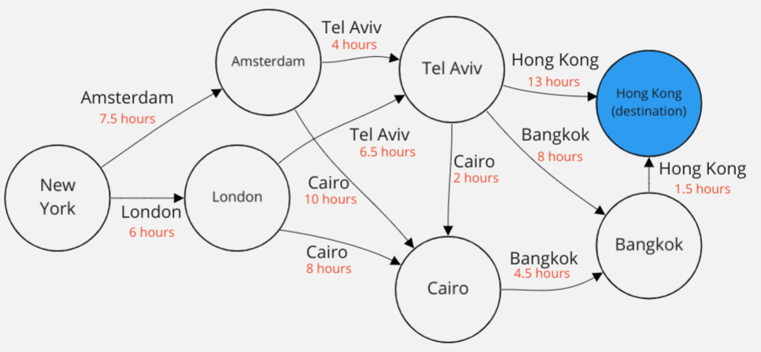

# 3.1 TD-Learning a Value Function from Experience¶
Let's get concrete & find the value function from experience in an environment!

We're again going to calculate the optimal value function for the flight path MDP we've seen before, but this time we'll learn it from interacting with an Env environment.

We've implemented this MDP in the `FlightPathEnv` class.

## Task

Your task is again to calculate the value_function in the format: `{"city": value}`.

You should do so by **interacting with the environment**. Follow the optimal policy that you calculated in previous tutorials (given below as optimal_policy). Each episode starts in New York.

You want to incrementally update the policy using the **TD-learning update rule** after each step.

You'll need to run through a reasonable number of episodes (100 should be fine - the more episodes, the closer it will converge) to get to the correct optimal value function.