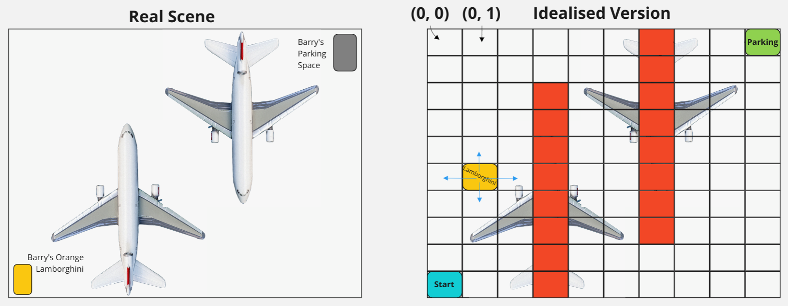

# 3.3 Barry's Parking Predicament
Time to bring TD-learning and  𝜖 -greedy together into solving a final problem for Barry!

Barry drives an orange Lamborghini. Since he's such a baller he parks in the airport hangar next to where several of his BarryJet planes are kept. (See left side of diagram below)

He's in the bottom left corner of the hangar (viewed from above). He wants to park his car in the top right corner, but needs to navigate around the two parked planes to do so.

The right side of the diagram shows an idealised version of the problem, which we're going to solve by writing our first Reinforcement Learning algorithm.

The hangar has been divided into grid squares. Barry wants to drive from the bottom left square to the top right. He cannot drive underneath the planes (although can go under the wings). The grid squares he can't drive through are shown in red.

You want to iteratively update the value function approximation using TD-learning, while using  𝜖 -greedy to ensure the explore-exploit tradeoff is well balanced.

## Your Task
Write your first RL algorithm with both 𝜖 -greedy and TD-learning to learn the optimal value function.

## Details
The state is represented as a tuple `(row_index, column_index)`, with two possible states in the top left shown.

The actions Barry can choose are shown in blue - he can go `North (-1, 0)`, `South (1, 0)`, `East (0, 1)` or `West (-1, 0)`. His car has a tiny turning circle, so it doesn't matter which direction it's pointing in - but he can't drive through the walls of the hangar or beneath the planes!

The `ParkingEnv` is the environment you'll interact with to solve the problem - it gives you the reward at each timestep and has the same functions as `Env` (`.reset()` and `.step()`).

The reward is **10** for reaching the parking spot and **0** otherwise.

Barry wants you to use  𝛾=0.95  as gamma, the time discount factor. Don't ask why.

### Tips & Hints:

**Be careful about the update equation for the final step**.

You expect a value of `10` in the top right corner in the value function.

### Optional Extra Exercises
- Play around with how many episodes you need to achieve a correct value function.
What does the value function look like after **1** episode?
- Try tweaking  𝜖  (how much your agent explores vs exploits) and see what happens to your value function over time.
    - What happens when 𝜖=1?
    - What about when 𝜖=0 ?
    - What's the optimal value of 𝜖 ?
