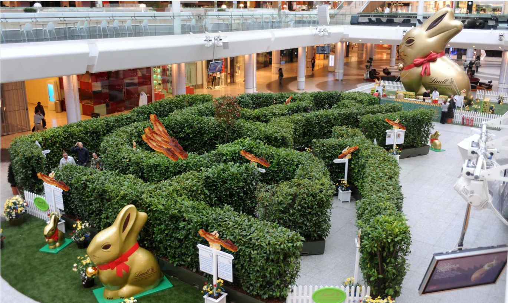

# 3. Exercise - Barry's Blissful Breakfasts
Barry decides to open **Barry's Blissful Breakfasts** - a fully operational restaurant which only serves his favourite breakfast of bacon cooked with vegetable oil.

To commemorate the anniversary of opening this restaurant, he wants to run an event for his customers. One Sunday evening after closing time, he builds a maze with obstacle-course elements in the restaurant. He hides prizes around the restaurant - vouchers for extra bacon or vegetable oil on your breakfast.

He then tests out the course and hidden prizes himself before deciding whether it's complete.

## Your Task

Calculate the return at each timestep of Barry's test run, given the rewards he receives in the test run.

The rewards are given as a list called `rewards`, where the first element `rewards[0]` corresponds to the reward at the first timestep.

The discount factor 𝛾 is set to `gamma = 0.9` to discount future rewards.
